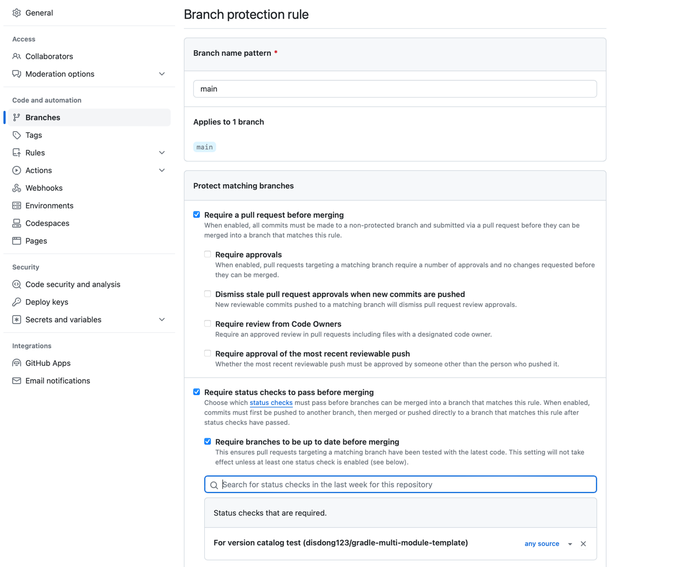

# Version catalog

버전 카탈로그는 의존성 목록을 한 곳에 정의하여 중앙에서 관리할 수 있게 해주는 방식을 제공합니다.

버전 카탈로그를 이용하면 각 프로젝트에서 의존성을 문자열로 관리하는 대신 IDE 에서 제공하는 자동완성 기능을 사용할 수 있습니다.

```kotlin
dependencies {
    // libs: 카탈로그
    // goovy.core: 카탈로그에서 사용 가능한 의존성
    implementation(libs.groovy.core)
}
```

버전 카탈로그를 이용하면 충돌이 해결된 의존성을 중앙에서 관리하고 공유할 수 있습니다. 여러 프로젝트에서 동일한 의존성을 사용할 때 각 프로젝트에서 별도로 충돌을 해결할 필요가 없어집니다.


Gradle 은 루트의 하위 디렉토리에서 libs.versions.toml 파일이 발견되면 gradle catalog 가 이 파일의 내용으로 선언됩니다.


### How to use
1. Github Personal access token 을 발급받고, github username 과 함께 환경변수(.zshrc 등)로 저장해야합니다.
2. settings.gradle 파일에 아래와 같이 작성합니다.
    ```kotlin
    enableFeaturePreview("VERSION_CATALOGS")
    
    dependencyResolutionManagement {
        repositories {
            maven {
                url = uri("https://maven.pkg.github.com/disdong123/version-catalog")
                credentials {
                    // PAT, github username 을 환경변수 (.zshrc 등)로 저장해야합니다.  
                    username = System.getenv("DISDONG_USERNAME")
                    password = System.getenv("DISDONG_TOKEN")
                }
            }
        }
        versionCatalogs {
            create("libs") {
                from("kr.disdong:spring-version-catalog:0.0.2")
            }
        }
    }
    ```


### 배포
Pull request 를 이용해야합니다.

1. PR 이 생성되면 version-catalog-test workflow 를 통해 최신 버전을 테스트합니다.
   - version-catalog 를 사용하는 특정 repository 에서 최신 version-catalog 를 로컬에 publish 하고 build 해보는 방식으로 테스트합니다.
   - 테스트에 실패하면 PR 을 머지할 수 없습니다.  
2. 테스트가 완료되면 publish workflow 를 통해 version-catalog 를 수동 배포합니다.

#### 테스트 repository 추가 방법
1. version-catalog-test workflow 에서 테스트하고자 하는 repository 를 추가합니다.
    ```
    workflows: [
      { repo: "disdong123/gradle-multi-module-template", workflow_id: "version-catalog-test.yaml" },
    ]
    ```
2. 테스트하고자 하는 repository 에 version-catalog-test workflow 를 추가합니다. (ex. https://github.com/disdong123/gradle-multi-module-template/blob/main/.github/workflows/version-catalog-test.yaml)
3. version-catalog repository 의 settings > Branches 의 아래 섹션에서 해당 repository 의 workflow 를 추가합니다.
    


## References
- https://docs.gradle.org/current/userguide/platforms.html
- https://docs.github.com/en/packages/working-with-a-github-packages-registry/working-with-the-gradle-registry